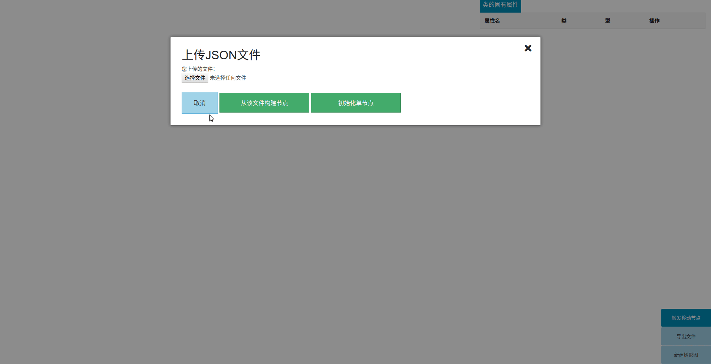

树型关系编辑器
================

基于项目[d3js Tree Editor](https://github.com/adamfeuer/d3js-tree-editor)，做了一些小改进，主要用于显示树型类的关系。

一些特性包括：

* 可以从本地加载`json`文件渲染树形图，也可以将树形图导出成`json`文件
* 可以给节点添加自定义的属性
* 可以通过鼠标拖拽移动节点

下面是演示动图：

想要实际操作的话，`clone`本项目到本地，然后用浏览器打开`index.html`文件就行了。